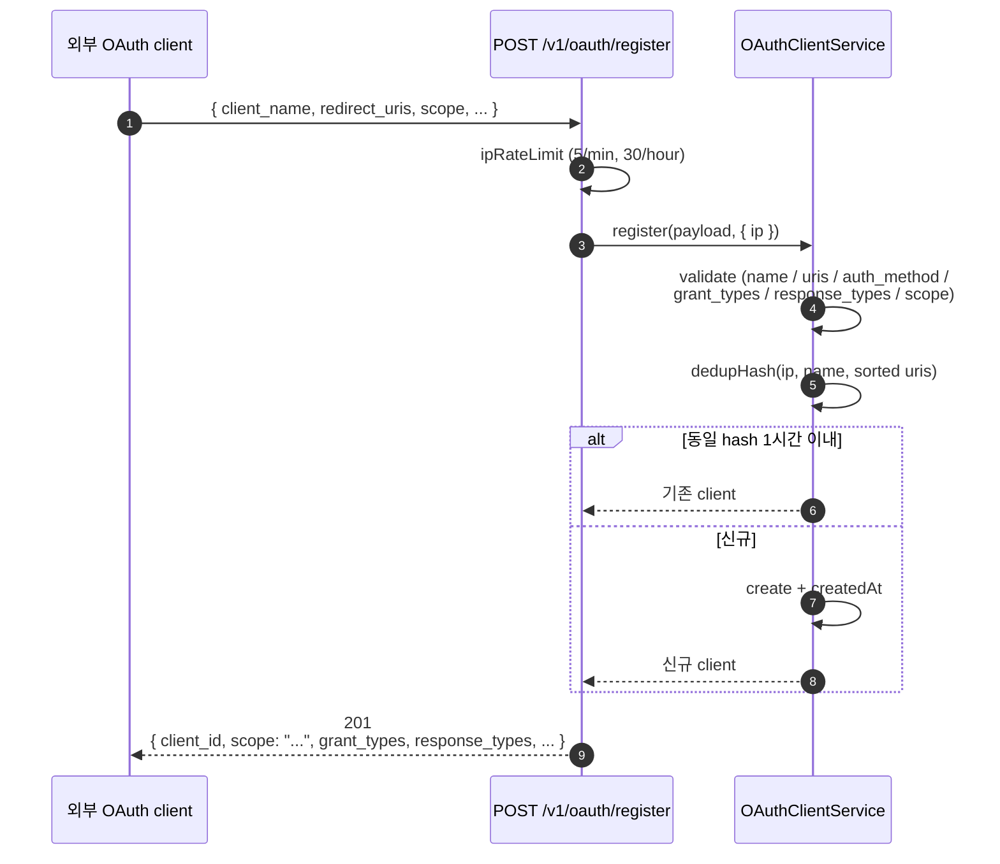
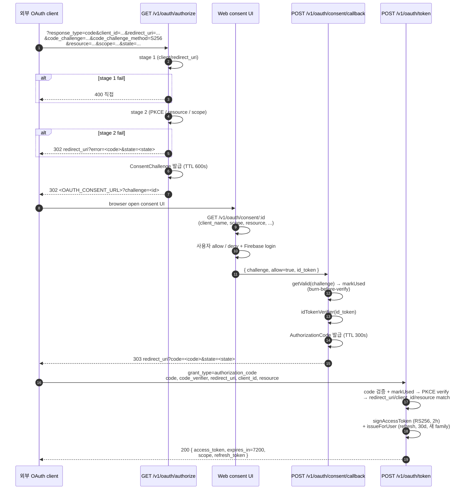
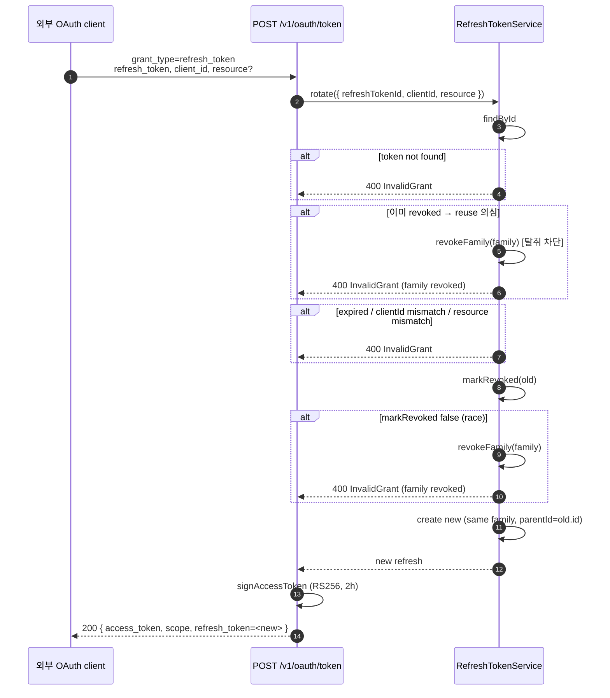
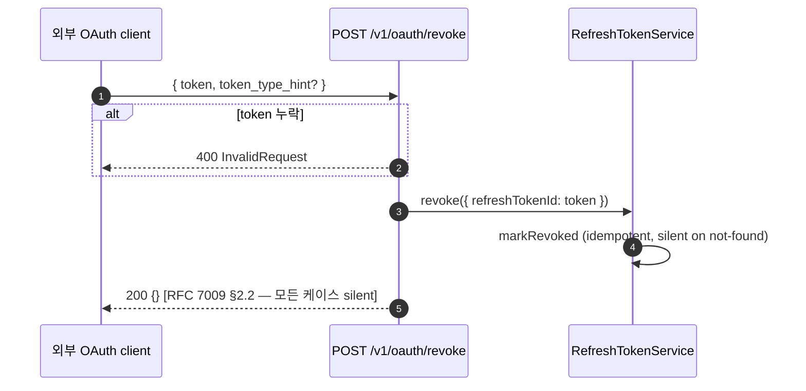

# OAuth 2.1 Authorization Server 스펙

외부 OAuth client 가 사용자 동의를 받아 보호 리소스 (calendar) 에 access_token 으로 접근할 수
있게 하는 Authorization Server (AS) 의 외부 인터페이스 명세. base path 는 `/v1/oauth/*` 와
`/.well-known/*`.

## 준수 RFC

| RFC | 항목 |
|---|---|
| RFC 6749 | OAuth 2.0 Authorization Framework (authorize / token 흐름의 베이스) |
| RFC 6749 §3.3 | scope wire-format (space-separated string) |
| RFC 7591 | Dynamic Client Registration (DCR) |
| RFC 7009 | Token Revocation |
| RFC 7636 | PKCE (S256 mandatory) |
| RFC 7638 | JWK Thumbprint (access_token JWT `kid` 생성) |
| RFC 8414 | Authorization Server Metadata |
| RFC 8707 | Resource Indicators (authorize / token 요청의 `resource` 파라미터) |

OAuth 2.1 의 강제 사항인 PKCE 필수, public client only (`token_endpoint_auth_method=none`),
authorization code flow 의 redirect URI exact match, refresh_token rotation 을 모두 따른다.

## 발급 토큰

| 토큰 | 형식 | TTL | 회수 |
|---|---|---|---|
| access_token | JWT (RS256, `kid` = JWK thumbprint) | 7200 s (2시간) | stateless — 자연 만료만 |
| refresh_token | opaque (random 32 bytes hex) | 30 일 absolute | rotation + reuse detect + RFC 7009 |

access_token claims:

```
iss = <issuer>
sub = <userId>
aud = <resource>
iat / exp
scope = "<space-separated string>"
client_id = <client_id>
```

refresh_token 은 서버 측 저장. rotation chain 은 `family` UUID 로 묶이고, 매 회전마다 새 token 의
`parentId` 가 이전 token 을 가리킨다.

## Discovery

### `GET /.well-known/oauth-authorization-server`

RFC 8414 metadata. 응답 200 + `Cache-Control: public, max-age=600`.

```json
{
  "issuer": "<issuer>",
  "authorization_endpoint": "<issuer>/v1/oauth/authorize",
  "token_endpoint": "<issuer>/v1/oauth/token",
  "registration_endpoint": "<issuer>/v1/oauth/register",
  "revocation_endpoint": "<issuer>/v1/oauth/revoke",
  "jwks_uri": "<issuer>/.well-known/jwks.json",
  "response_types_supported": ["code"],
  "grant_types_supported": ["authorization_code", "refresh_token"],
  "code_challenge_methods_supported": ["S256"],
  "token_endpoint_auth_methods_supported": ["none"],
  "revocation_endpoint_auth_methods_supported": ["none"],
  "scopes_supported": ["read:calendar", "write:calendar"]
}
```

`issuer` 의 trailing slash 는 서버에서 정규화 (제거). RFC 8414 §3.1 — issuer 가 path 를 포함하는
경우, host-root 아래 `/.well-known/oauth-authorization-server` 에 `<path>` 가 이어 붙어 client 가
요청을 친다. 서버 측은 host-root path 가 같은 라우터로 도달하도록 hosting / proxy 가 구성되어야 한다.

### `GET /.well-known/jwks.json`

access_token 검증에 쓰는 public key (JWK Set). 200 + `Cache-Control: public, max-age=600`.

```json
{
  "keys": [
    {
      "kty": "RSA",
      "n": "<modulus>",
      "e": "AQAB",
      "alg": "RS256",
      "use": "sig",
      "kid": "<JWK thumbprint, RFC 7638>"
    }
  ]
}
```

`kid` 는 public key 의 JWK thumbprint. access_token JWT 의 `kid` header 와 일치.

## Endpoints

### `POST /v1/oauth/register` — DCR (RFC 7591)

#### 요청

`Content-Type: application/json`. 본문:

```json
{
  "client_name": "string (1~64 chars, no control chars)",
  "redirect_uris": ["https://... or http://(localhost|127.0.0.1)/..."],
  "scope": "space-separated subset of supported scopes",
  "token_endpoint_auth_method": "none",
  "grant_types": ["authorization_code", "refresh_token?"],
  "response_types": ["code"]
}
```

#### 검증

| 항목 | 규칙 |
|---|---|
| `client_name` | 비어있지 않은 string, 길이 ≤ 64, 제어문자 (`\x00`–`\x1F`, `\x7F`) 금지 |
| `redirect_uris` | 비어있지 않은 array. 각 URI 는 HTTPS 또는 loopback (`http://127.0.0.1` / `http://localhost`). fragment 금지. userinfo (`user@host` / `user:pass@host`) 금지 |
| `token_endpoint_auth_method` | 정확히 `"none"` |
| `grant_types` | 비어있지 않은 array. 각 원소가 `["authorization_code", "refresh_token"]` 의 부분집합. `authorization_code` 필수 포함 |
| `response_types` | 모든 원소가 `"code"` |
| `scope` | `parseScopeString` 로 array 변환. 알 수 없는 scope 거부 |

#### Rate limit

IP 당:
- 1분 윈도우: 기본 5회 (env `OAUTH_RATE_LIMIT_REGISTER_MAX_PER_MINUTE`)
- 1시간 윈도우: 기본 30회 (env `OAUTH_RATE_LIMIT_REGISTER_MAX_PER_HOUR`)

#### Dedup (L3)

같은 `(ip, client_name, sorted redirect_uris)` 가 1시간 이내 재요청이면 기존 client 그대로 반환
(새 record 생성 안 함). 봇이 다른 scope 로 재시도해도 dedup window 안엔 기존 `client_id` 유지.

#### 응답

201 Created:

```json
{
  "client_id": "<uuid>",
  "client_id_issued_at": 1730000000,
  "client_name": "...",
  "redirect_uris": ["..."],
  "scope": "read:calendar write:calendar",
  "token_endpoint_auth_method": "none",
  "grant_types": ["authorization_code", "refresh_token"],
  "response_types": ["code"]
}
```

`scope` 는 RFC 7591 §2 따라 **space-separated string**.

#### 실패

| HTTP | code | 상황 |
|---|---|---|
| 400 | `InvalidRequest` | 입력 검증 실패 (client_name / redirect_uris / grant_types / response_types / auth_method) |
| 400 | `InvalidScope` | scope 가 알 수 없거나 비어있음 |
| 429 | rate limit 초과 | IP 당 분/시간 한도 초과 |

---

### `GET /v1/oauth/authorize` — Authorization Request (RFC 6749 §4.1.1)

#### 요청 (query string)

| 파라미터 | 필수 | 규칙 |
|---|---|---|
| `response_type` | ✓ | `"code"` |
| `client_id` | ✓ | DCR 로 등록된 client |
| `redirect_uri` | ✓ | client 의 `redirect_uris` 중 하나와 exact match |
| `state` | 권장 | client 측 CSRF 방지용 임의값. AS 는 그대로 보존 후 callback 에서 돌려줌 |
| `code_challenge` | ✓ | PKCE challenge (RFC 7636) |
| `code_challenge_method` | ✓ | `"S256"` (plain 거부) |
| `resource` | ✓ | 보호 리소스 canonical URI. 화이트리스트 (`OAUTH_CALENDAR_RESOURCE_URI`) 중 하나 |
| `scope` | ✓ | client 의 등록 scope 의 부분집합 |

#### 검증 단계

1. **Stage 1 — client / redirect_uri** 검증. 실패 시 **400 직접 응답** (redirect 못 함 — attacker
   injection 위험).
2. **Stage 2 — 그 외 검증**. 실패 시 **redirect_uri 로 error redirect** (RFC 6749 §4.1.2.1).

#### 성공

302 redirect:

```
Location: <OAUTH_CONSENT_URL>?challenge=<challengeId>
```

`<OAUTH_CONSENT_URL>` 에 기존 query 가 있으면 `&` 로 이어 붙임. consent challenge 는 TTL 600 s,
1회용.

#### Stage 1 실패

| HTTP | code | 상황 |
|---|---|---|
| 400 | `InvalidClient` | `client_id` 없음 / 등록되지 않음 |
| 400 | `InvalidRedirectUri` | `redirect_uri` 누락 또는 client 등록값과 mismatch |

#### Stage 2 실패 — redirect with error

`<redirect_uri>?error=<code>&state=<state>` 로 302 redirect. RFC 6749 §4.1.2.1 의 표준 error
code 사용:

| oauth error | 상황 |
|---|---|
| `unsupported_response_type` | `response_type` 가 `"code"` 아님 |
| `invalid_request` | `code_challenge_method` 가 `"S256"` 아님 / `code_challenge` 누락 / `resource` 가 whitelist 에 없음 |
| `invalid_scope` | scope 형식 오류 / 알 수 없는 scope / client 등록 scope 의 부분집합 아님 |

---

### `GET /v1/oauth/consent/:id` — Consent Payload

브라우저 consent UI 가 challenge 의 메타데이터를 가져오는 endpoint.

#### 응답 — 200

```json
{
  "client_name": "...",
  "redirect_uri_origin": "https://example.com",
  "scope": "read:calendar write:calendar",
  "resource": "https://api.example.com/...",
  "expires_at": 1730000600000
}
```

- `scope` 는 RFC 6749 §3.3 wire-format (space-separated string).
- `redirect_uri_origin` 은 challenge 의 `redirect_uri` 에서 origin 만 추출 (사용자에게 안전하게 표시).
- `expires_at` 은 challenge 만료 시각 (epoch ms).

#### 실패

| HTTP | body |
|---|---|
| 404 | `{ "error": "InvalidChallenge", "reason": "<expired|used|unknown>" }` |

내부 정합성 깨짐 (`InconsistentState`) 등은 500.

---

### `POST /v1/oauth/consent/callback` — Consent Result

브라우저 consent UI 가 사용자의 allow / deny 결과를 전달.

#### 요청

`Content-Type: application/x-www-form-urlencoded`. 본문:

| 필드 | 의미 |
|---|---|
| `challenge` | consent challenge id |
| `allow` | `"true"` 면 동의, 그 외는 거부 |
| `id_token` | (allow 시) 사용자의 identity 증명 token (Firebase ID token 등). `idTokenVerifier` 가 검증해 `uid` / `sub` 추출 |

#### 흐름 (burn-before-verify)

1. `challenge` 유효성 확인 (없음 / 만료 / 이미 사용 → error redirect).
2. challenge 를 즉시 `markUsed` (검증 실패 케이스도 challenge 소진 — hijack / replay 차단).
3. `allow=false` → `<redirect_uri>?error=access_denied&state=<state>` 로 303 redirect.
4. `allow=true` → `id_token` 검증 → AuthorizationCode 발급 → `<redirect_uri>?code=<code>&state=<state>` 로 303 redirect.

AuthorizationCode TTL 은 300 s, 1회용.

#### 실패

| HTTP | 동작 |
|---|---|
| 302 | challenge 가 expired / used / unknown → `<OAUTH_CONSENT_URL>/error?reason=<reason>` 으로 redirect |
| 401 `InvalidCredentials` | `id_token` 누락 / 검증 실패 |
| 500 | 내부 처리 실패 |

---

### `POST /v1/oauth/token` — Token Endpoint (RFC 6749 §3.2)

`Content-Type: application/x-www-form-urlencoded`. 인증 없음 (public client).

#### grant_type = `authorization_code`

##### 요청

| 필드 | 의미 |
|---|---|
| `grant_type` | `"authorization_code"` |
| `code` | `/consent/callback` 의 redirect 로 받은 code |
| `code_verifier` | PKCE verifier. AS 가 `S256(code_verifier)` 가 challenge 와 일치하는지 검증 |
| `redirect_uri` | authorize 요청 때와 exact match |
| `client_id` | 발급된 client |
| `resource` | authorize 요청 때와 exact match |

##### 흐름

1. code 의 유효성 (존재 / 만료 / 미사용) 확인.
2. code 를 즉시 `markUsed` (검증 실패 시도 replay 차단).
3. PKCE `code_verifier` 검증 (RFC 7636 — 43~128 unreserved chars, base64url(sha256(verifier)) === code_challenge, timing-safe equal).
4. `redirect_uri` / `client_id` / `resource` 의 stored 값과 일치 확인.
5. access_token 서명 + 새 refresh_token (새 family chain 시작) 발급.

##### 응답 — 200

```json
{
  "access_token": "<JWT>",
  "token_type": "Bearer",
  "expires_in": 7200,
  "scope": "read:calendar write:calendar",
  "refresh_token": "<opaque>"
}
```

#### grant_type = `refresh_token`

##### 요청

| 필드 | 의미 |
|---|---|
| `grant_type` | `"refresh_token"` |
| `refresh_token` | 기존 refresh_token id |
| `client_id` | 발급 시점의 client 와 일치 |
| `resource` | (선택) 지정 시 발급 시점 값과 exact match 강제 |

##### 흐름 — rotation + reuse detect

1. stored refresh_token 조회. 없으면 400 `InvalidGrant`.
2. **이미 revoked** 면 reuse 의심 → **family 전체 revoke** + 400 (탈취 차단).
3. 만료 / client_id mismatch / resource mismatch → 400.
4. `markRevoked` 실행. false (이미 누군가 revoke — 동시 두 요청 race) → **family 전체 revoke** + 400.
5. 같은 family, `parentId = old.id` 로 새 refresh_token 발급.
6. 같은 user / scope / resource 로 새 access_token 서명.

##### 응답 — 200 (authorization_code 와 동일 schema)

#### 실패 공통

| HTTP | code | 상황 |
|---|---|---|
| 400 | `InvalidRequest` | body 의 필수 필드 (`refresh_token`, `client_id`) 누락 |
| 400 | `InvalidGrant` | code/refresh 검증 실패 (만료 / 이미 사용 / PKCE mismatch / clientId mismatch / resource mismatch / reuse detected) |
| 400 | `UnsupportedGrantType` | `grant_type` 이 위 두 값 아님 |

---

### `POST /v1/oauth/revoke` — Token Revocation (RFC 7009 §2.1)

`Content-Type: application/x-www-form-urlencoded`. 인증 없음.

#### 요청

| 필드 | 의미 |
|---|---|
| `token` | 회수 대상 token (refresh_token id). 필수 |
| `token_type_hint` | (선택) `refresh_token` 등. RFC §2.1 — 잘못 지정/미지정이어도 모든 type 을 검색해야 한다. 본 서버는 항상 refresh_token 으로 시도. |

#### 응답

| HTTP | body |
|---|---|
| 200 | `{}` (RFC 7009 §2.2 — not-found / 이미 revoked / 잘못된 type 모두 silent) |
| 400 `InvalidRequest` | `token` 누락 / 빈 문자열 |

access_token 은 JWT stateless 라 회수 불가 (no-op). 사용자 권한 철회 시 refresh_token 만 회수
되며, access_token 은 자연 만료 (최대 2시간 이내) 로 같은 효과.

## PKCE

- `code_challenge_method = "S256"` 만 지원 (`"plain"` 거부).
- `code_verifier` 는 RFC 7636 §4.1 — 43~128자 unreserved 문자 (`ALPHA` / `DIGIT` / `"-"` / `"."` / `"_"` / `"~"`).
- 검증: `base64url(sha256(code_verifier))` 가 stored `code_challenge` 와 일치 (timing-safe equal).

## Resource Indicator (RFC 8707)

- `authorize` / `token` (authorization_code) 모두 `resource` 파라미터 필수.
- 허용 값은 환경변수 `OAUTH_CALENDAR_RESOURCE_URI` 의 화이트리스트 (현재 단일 값).
- `token` (refresh_token) 은 `resource` 가 들어오면 stored 값과 exact match 강제. 누락 가능.

## Scope wire-format

| 위치 | 형식 | 근거 |
|---|---|---|
| AS metadata `scopes_supported` | JSON array | RFC 8414 §2 — capability 광고 |
| 그 외 모든 wire-level scope value (DCR 요청/응답, authorize query, token 응답, JWT claim, consent payload 등) | space-separated string | RFC 6749 §3.3 |

서버는 array ↔ string 변환을 `parseScopeString` / `formatScopeArray` (`models/oauth/scopes.js`) 로
중앙화한다.

## Cleanup (서버 측 정리)

| Scheduled function | 주기 | 대상 |
|---|---|---|
| `oauthClientCleanup` | 24 시간 | `lastUsedAt = null` + 등록 후 일정 일수 (env `OAUTH_CLIENT_CLEANUP_AGE_DAYS`, 기본 30일) 초과한 client |
| `oauthRefreshTokenCleanup` | 24 시간 | `expiresAt < now` 인 refresh_token |

Firestore TTL policy 가 적용 불가한 동안의 대체 정리 매커니즘. revoked-but-not-expired 정리(grace)
는 향후 별도 메소드로 분리 예정.

## 에러 응답 형식

도메인 표준 에러 모델 (`models/Errors`) 을 그대로 사용:

```json
{
  "status": 400,
  "code": "InvalidRequest",
  "message": "..."
}
```

OAuth 표준 흐름에서 redirect 응답이 요구되는 경우 (authorize stage 2, consent callback)
RFC 6749 §4.1.2.1 의 redirect-with-error 규칙을 따른다 (위 endpoint 절 참조).

## 시퀀스

### DCR — client 등록



### Authorization Code + PKCE



### Refresh — rotation + reuse detect



### Revocation (RFC 7009)


