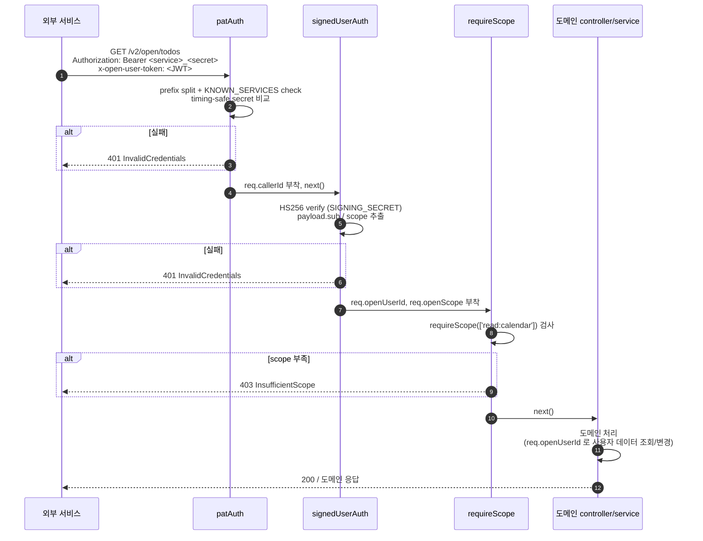

# openAPI 스펙

외부 서비스가 사용자 캘린더 데이터를 read/write 할 수 있게 하는 인증된 API 게이트웨이.
base path 는 `/v2/open/*`. 도메인 layer (todo / schedule / tag / done / event_detail) 와 같은
저장소를 공유하되, 외부 호출을 위한 별도 인증·인가 layer 를 갖는다.

## Overview

```
┌───────────────────┐                   ┌─────────────────────────────┐
│  외부 서비스       │ ── HTTPS ───▶    │  openAPI (/v2/open/*)        │
│  (PAT + user JWT) │                   │  - patAuth (서비스 식별)     │
│                   │                   │  - signedUserAuth (사용자)   │
│                   │                   │  - requireScope              │
│                   │                   │  - 도메인 controllers/svc   │
└───────────────────┘                   └─────────────────────────────┘
```

요청 한 건마다 두 layer 검증을 통과해야 도메인 layer 에 도달한다.

1. **PAT (Personal Access Token)** — 호출 서비스를 식별. 화이트리스트에 등록된 서비스만 통과.
2. **Signed user JWT** — 어떤 사용자의 데이터를 다루는지 식별. 별도 채널에서 발급된 JWT 를 헤더로 전달.
3. **Scope** — endpoint 마다 필요한 scope (`read:calendar` / `write:calendar`) 강제.

## 인증

### Layer 1 — PAT (`Authorization` 헤더)

요청 헤더 형식:

```
Authorization: Bearer <service>_<secret>
```

- `<service>` — 호출 서비스 식별자. 화이트리스트 (`KNOWN_SERVICES`) 에 등록된 값.
- `<secret>` — 해당 서비스의 PAT secret. `OPENAPI_PAT_<SERVICE>` (대문자) 환경변수에 저장된 값과
  timing-safe equal 비교.
- 첫 번째 `_` 위치로 split. service prefix 가 비었거나 secret 이 비면 401.

실패 케이스:

| 조건 | 응답 |
|---|---|
| `Authorization` 헤더 없음 또는 `Bearer ` 로 시작 안 함 | 401 `InvalidCredentials` |
| `_` 누락 또는 split 결과 한쪽이 빈 문자열 | 401 `InvalidCredentials` |
| service 가 화이트리스트에 없음 | 401 `InvalidCredentials` |
| env 에 해당 service secret 미구성 | 500 `ServerMisconfigured` |
| secret 불일치 | 401 `InvalidCredentials` |

통과 시 `req.callerId = <service>` 로 호출 서비스가 기록된다.

### Layer 2 — Signed user JWT (`x-open-user-token` 헤더)

요청 헤더:

```
x-open-user-token: <JWT>
```

- 알고리즘 **HS256** 고정. 검증키는 `SIGNING_SECRET` 환경변수.
- payload 형식:

```json
{
  "sub": "<userId>",
  "scope": ["read:calendar", "write:calendar"]
}
```

- `sub` 는 비어있지 않은 문자열 필수. `scope` 는 array (없거나 형식 불일치 시 빈 배열로 취급).
- `iss` 는 검증 대상 아님 (issuer-agnostic — 다중 발급자 허용).
- 만료(`exp`) 등 표준 클레임은 `jsonwebtoken.verify` 가 자동 검증.

실패 케이스:

| 조건 | 응답 |
|---|---|
| `x-open-user-token` 헤더 없음 또는 빈 문자열 | 401 `InvalidCredentials` |
| env `SIGNING_SECRET` 미구성 | 500 `ServerMisconfigured` |
| HS256 서명 불일치 또는 만료 / 형식 깨짐 | 401 `InvalidCredentials` |
| payload 의 `sub` 누락 / non-string | 401 `InvalidCredentials` |

통과 시 `req.openUserId = sub`, `req.openScope = scope` 로 사용자/권한이 기록된다.

### Layer 3 — Scope enforcement (`requireScope`)

각 라우트에 필요한 scope 를 미들웨어로 강제.

```
const READ  = requireScope(['read:calendar']);
const WRITE = requireScope(['write:calendar']);
router.get('/', READ, ...);
router.post('/', WRITE, ...);
```

- 요구 scope 중 하나라도 `req.openScope` 에 없으면 **403 `InsufficientScope`**.
- `required` 가 빈 배열이면 검사 통과 (스코프 무관 endpoint).

## Scope

| scope | 의미 |
|---|---|
| `read:calendar` | 캘린더 데이터 (todo / schedule / tag / done / event_detail) 조회 |
| `write:calendar` | 생성 / 수정 / 삭제 / 완료 / revert / branch 등 변경 작업 |

스코프는 누적이 아니라 endpoint 별 명시 요구. 변경 endpoint 가 `read:calendar` 를 별도로 요구하지는
않는다 (write 만으로 충분).

## Endpoint 목록

base prefix `/v2/open` 아래 여섯 그룹. 마운트 순서상 `dones` 가 `todos` 보다 먼저
등록되어, `/todos/dones/...` 가 `/todos/` prefix 매칭에 흡수되지 않도록 한다.

### `todos`

| Method | Path | Scope |
|---|---|---|
| GET | `/v2/open/todos/` | read |
| GET | `/v2/open/todos/uncompleted` | read |
| GET | `/v2/open/todos/:id` | read |
| POST | `/v2/open/todos/` | write |
| PUT | `/v2/open/todos/:id` | write |
| PATCH | `/v2/open/todos/:id` | write |
| DELETE | `/v2/open/todos/:id` | write |
| POST | `/v2/open/todos/:id/complete` | write |
| POST | `/v2/open/todos/:id/replace` | write |

### `todos/dones`

| Method | Path | Scope |
|---|---|---|
| GET | `/v2/open/todos/dones/` | read |
| GET | `/v2/open/todos/dones/:id` | read |
| PUT | `/v2/open/todos/dones/:id` | write |
| DELETE | `/v2/open/todos/dones/:id` | write |
| POST | `/v2/open/todos/dones/:id/revert` | write |

### `schedules`

| Method | Path | Scope |
|---|---|---|
| GET | `/v2/open/schedules/` | read |
| GET | `/v2/open/schedules/:id` | read |
| POST | `/v2/open/schedules/` | write |
| PUT | `/v2/open/schedules/:id` | write |
| PATCH | `/v2/open/schedules/:id` | write |
| PATCH | `/v2/open/schedules/:id/exclude` | write |
| POST | `/v2/open/schedules/:id/exclude` | write |
| POST | `/v2/open/schedules/:id/branch_repeating` | write |
| DELETE | `/v2/open/schedules/:id` | write |

### `tags`

| Method | Path | Scope |
|---|---|---|
| GET | `/v2/open/tags/` | read |
| POST | `/v2/open/tags/` | write |
| PUT | `/v2/open/tags/:id` | write |
| DELETE | `/v2/open/tags/:id` | write |

### `event_details`

| Method | Path | Scope |
|---|---|---|
| GET | `/v2/open/event_details/:id` | read |
| PUT | `/v2/open/event_details/:id` | write |
| DELETE | `/v2/open/event_details/:id` | write |
| GET | `/v2/open/event_details/done/:id` | read |
| PUT | `/v2/open/event_details/done/:id` | write |
| DELETE | `/v2/open/event_details/done/:id` | write |

### `foremost`

serviceAPI `/v1/foremost/event` 와 동등. 사용자당 단일 foremost event (todo 또는 schedule) 지정/조회/해제.

| Method | Path | Scope |
|---|---|---|
| GET | `/v2/open/foremost/event` | read |
| PUT | `/v2/open/foremost/event` | write |
| DELETE | `/v2/open/foremost/event` | write |

- `GET` — 현재 foremost event. 미지정 시 빈 객체 `{}`.
- `PUT` — body `{ event_id, is_todo }` 로 지정/교체. `is_todo` 는 boolean (serviceAPI 의 string 관용 파싱 없음). 누락 시 400. 응답 201 + `ForemostEvent`.
- `DELETE` — 해제. 응답 200 + `{ status: 'ok' }`.

각 endpoint 의 요청 body / 응답 모델은 swagger 정의 (`functions/swagger.yaml`) 와 도메인 모델
(`models/Todo`, `models/Schedule`, `models/EventTag`, `models/DoneTodo`, `models/EventDetail`,
`models/ForemostEvent`) 을 재사용한다. 인증/스코프 외 라우팅·검증·응답 형식은 도메인 layer 와 동일.

## 에러 응답 형식

도메인 layer 의 표준 에러 모델 (`models/Errors`) 을 그대로 사용. 응답 본문 형식:

```json
{
  "status": 401,
  "code": "InvalidCredentials",
  "message": "Invalid credentials"
}
```

| HTTP | code | 상황 |
|---|---|---|
| 401 | `InvalidCredentials` | PAT / signed user JWT 검증 실패 |
| 403 | `InsufficientScope` | 요청한 endpoint 에 필요한 scope 없음 |
| 400 | `BadRequest` 등 | 도메인 layer 의 입력 검증 실패 |
| 404 | `NotFound` | 도메인 자원 없음 |
| 500 | `ServerMisconfigured` | env (`OPENAPI_PAT_*`, `SIGNING_SECRET`) 누락 |
| 500 | `Application` | 도메인 layer 의 처리 중 예외 |

## 시퀀스 — 요청 한 건의 처리



## 서비스 화이트리스트 / 시크릿

- **`KNOWN_SERVICES`** — 코드 상수 (`middlewares/openapi/patAuth.js`). 새 서비스 추가는 코드 수정 필요.
- **PAT secret** — service 별로 별도 env (`OPENAPI_PAT_<SERVICE>`, 대문자). 환경변수 값에는
  prefix 없이 secret 만 (예: `OPENAPI_PAT_FOO=abc123...`). 검증 시 인입 토큰을 `_` 로 split 한 뒤
  secret 부분만 비교하므로, env 에 prefix 가 섞이면 절대 일치하지 않는다.
- **사용자 JWT 서명키** — `SIGNING_SECRET` 단일 env. 모든 발급자가 같은 값을 공유.

운영·로테이션 정책은 별도 운영 문서 (`CLAUDE.md` 의 "openAPI 시크릿 운영 정책") 참조.
