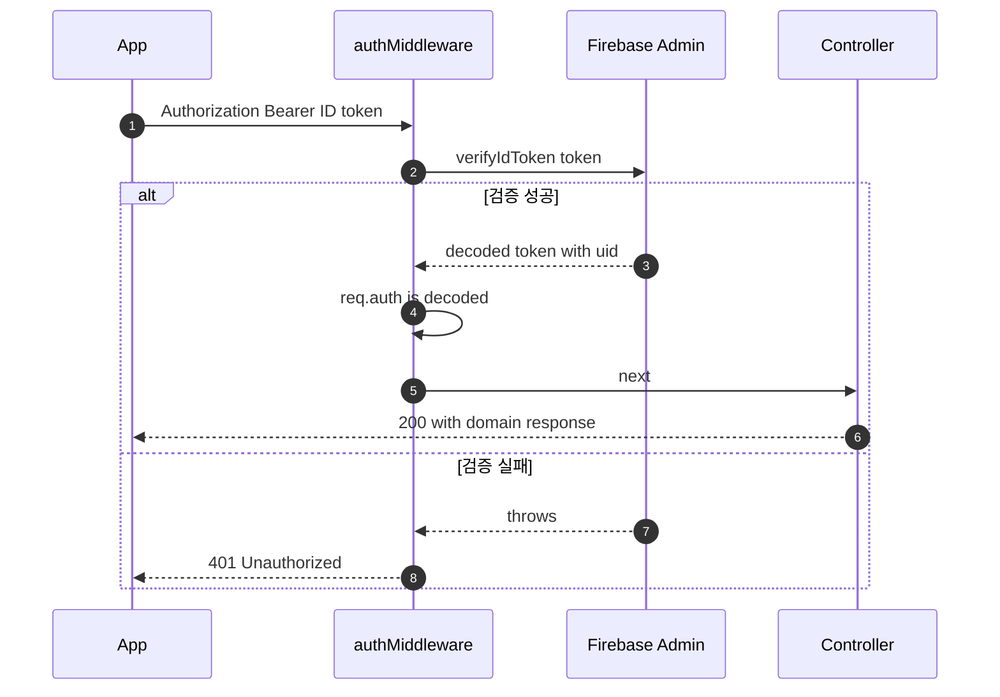
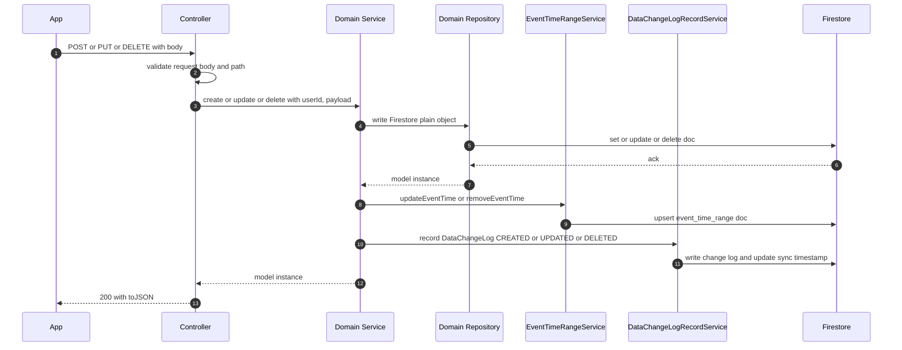
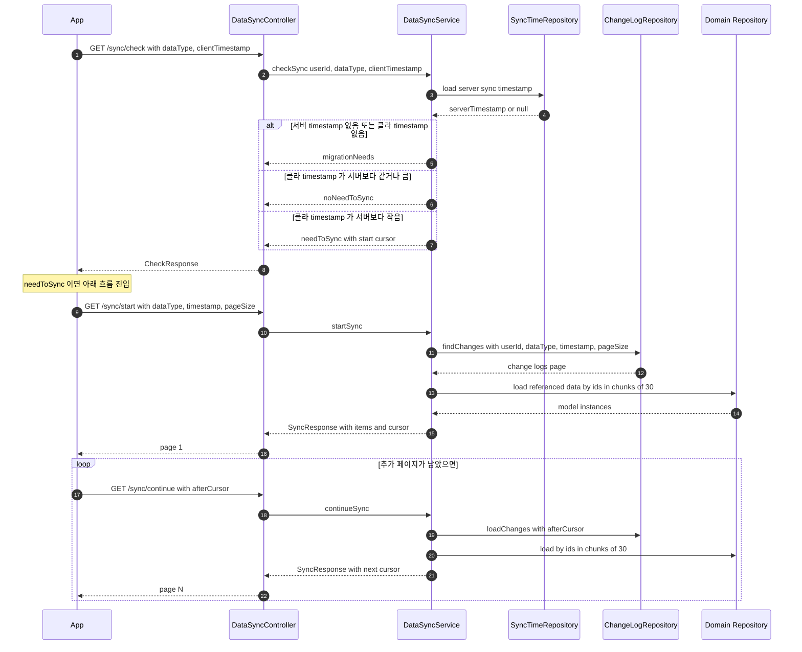

# serviceAPI 스펙

TodoCalendar 앱이 직접 호출하는 도메인 API. base path `/v1/*` + `/v2/*`. Firebase Auth 토큰
검증 후 도메인 (todo / schedule / tag / done / event_detail / foremost / sync / setting /
migration / user / accounts / holiday) 레이어 로 진입.

운영 / 시크릿 정책은 [`CLAUDE.md`](../../CLAUDE.md) 참조. openAPI / aiFrontAPI / OAuth 같은
별 라우트 그룹은 각각 [`openapi.md`](openapi.md) / [`aiFront.md`](aiFront.md) /
[`oauth.md`](oauth.md).

## Overview

```
┌─────────┐  HTTPS + Authorization Bearer <ID token>   ┌─────────────────┐
│   App   │ ─────────────────────────────────────────▶ │  serviceAPI     │
│         │                                            │  /v1/* /v2/*    │
└─────────┘                                            └────────┬────────┘
                                                                │
                          ┌─────────────────────────────────────┴──────────┐
                          ▼                                                ▼
                  ┌──────────────┐                                ┌────────────────┐
                  │ Firebase     │                                │ Domain layer   │
                  │ Auth         │                                │ (router →      │
                  │ middleware   │ ── req.auth.uid ─────────────▶ │  controller →  │
                  └──────────────┘                                │  service →     │
                                                                  │  repository)   │
                                                                  └────────┬───────┘
                                                                           │
                                                                           ▼
                                                                  ┌────────────────┐
                                                                  │  Firestore     │
                                                                  └────────────────┘
```

라우터가 composition root — 모든 의존성을 constructor injection 으로 wiring. DI 컨테이너 없음.

## Layer 구조

```
routes/ (composition root)
  └── controllers/ (HTTP 입출력 검증)
        └── services/ (비즈니스 로직)
              └── repositories/ (Firestore IO, 모델 인스턴스 반환)
```

- **`routes/`** — Express 라우터 + 의존성 wiring. 환경 분기 (`FUNCTIONS_EMULATOR`) 도 여기서만.
- **`controllers/`** — request body / path / header 검증, `Errors.Application` 으로 감싸기.
  `express-async-errors` 가 async throw 를 자동 catch.
- **`services/`** — 도메인 로직. cross-cutting service 호출 책임 보유. dependency 는 항상 주입.
- **`repositories/`** — Firestore read/write. 도메인 모델 인스턴스 (`Todo.fromData(...)`) 반환.

## API Versioning

라우트는 `/v1/*` + `/v2/*` 두 prefix 로 mount. `setVersion('v1' or 'v2')` 미들웨어가 `req.apiVersion`
세팅 → service 가 필요시 분기 (예: tag delete 동작이 v1/v2 다름).

## 도메인 라우트

| Path | Router | Auth | Spec |
|---|---|---|---|
| `/v1\|v2/accounts` | `accountRouter` | ❌ | sign-in / 계정 생성 / 토큰 갱신 |
| `/v1\|v2/user` | `userRouter` | ✅ | 본인 user doc + device 관리 (push token 등) |
| `/v1\|v2/todos` | `todoRouter` | ✅ | Todo CRUD, complete / replace, repeating |
| `/v1\|v2/todos/dones` | `doneTodoRouter` | ✅ | 완료된 todo 조회 / revert / delete |
| `/v1\|v2/schedules` | `scheduleRouter` | ✅ | Schedule CRUD, exclude / branch_repeating |
| `/v1\|v2/foremost` | `foremostEventRouter` | ✅ | 가장 먼저 표시할 단일 event 관리 |
| `/v1\|v2/tags` | `eventTagRouter` | ✅ | EventTag CRUD (v1/v2 delete 동작 다름) |
| `/v1\|v2/event_details` | `eventDetailRouter` | ✅ | event 메모/위치 등 부가 데이터 |
| `/v1\|v2/migration` | `migrationRouter` | ✅ | 클라 → 서버 일괄 import (계정 통합 / 기기 이전) |
| `/v1\|v2/setting` | `settingRouter` | ✅ | 사용자 setting doc |
| `/v1\|v2/sync` | `syncRouter` | ✅ | DataChangeLog 기반 incremental sync |
| `/v1\|v2/holiday` | `holidayRouter` | ❌ | 공휴일 정보 (외부 Google Calendar) |

상세 endpoint 는 `/api-docs` (swagger) 참조.

## Cross-cutting Services

모든 mutation (create / update / delete) 가 두 cross-cutting service 를 동시에 호출해야 데이터
일관성이 유지된다. 도메인 service 의 mutation 메서드는 항상 셋 다 묶음으로 본다.

| Service | 위치 | 책임 |
|---|---|---|
| `EventTimeRangeService` | `services/eventTimeRangeService.js` | 모든 event (todo / schedule) 의 시간 범위 인덱스 유지. range 쿼리 / 미완료 todo 조회의 기반. |
| `DataChangeLogRecordService` | `services/dataChangeLogRecordService.js` | `DataChangeLog` 레코드 (CREATED / UPDATED / DELETED) + sync timestamp 업데이트. `DataSyncService` 의 데이터 소스. |
| `EventDetailDataService` | `services/eventDetailService.js` | 활성 event 와 done 처리된 todo 의 event_detail 을 두 repository 로 분리 관리. |
| `DataSyncService` | `services/dataSyncService.js` | 클라가 보낸 last timestamp 기준으로 변경분 페이지네이션 반환. |

## Firestore Chunking 패턴

Firestore `in` 쿼리는 30개 제한. event 들을 ID 로 일괄 로딩할 때 service 가 30개씩 chunk 로 나누고
`Promise.all` 로 병렬 처리. helper 는 `Utils/functions.js` 의 `chunk`. todo / schedule 의 범위
조회 → ID 들 → 일괄 로딩 흐름이 모두 이 패턴.

## Models

도메인 모델은 `models/` 에 위치. 각 모델은 `toJSON()` (Express serialization), `fromData(id, data)`
(Firestore snapshot → 인스턴스) 가짐. repository 는 plain object 가 아니라 모델 인스턴스를 반환.

- **Domain**: `Todo`, `Schedule`, `EventTag`, `DoneTodo`, `ForemostEvent`, `Account`
- **Shared value objects**: `EventTime` (at / period / allday), `Repeating`
- **Infrastructure**: `DataTypes`, `DataChangeLog`, `Errors`, `SyncResponse`

---

## 시퀀스: 인증

모든 인증 필수 라우트가 거치는 흐름. accounts 와 holiday 는 미들웨어 미적용.



---

## 시퀀스: Mutation (Create / Update / Delete)

todo / schedule / done / tag / event_detail 의 모든 mutation 이 공통으로 따르는 흐름. 도메인
service 가 cross-cutting 두 service 를 함께 호출한다.



- 도메인 service 는 Firestore admin SDK 에 plain object 만 전달 — 모델 인스턴스는 destructure
  또는 `toJSON()` 으로 변환 후 write. (`Couldn't serialize object of type X` throw 원인)
- `DataChangeLogRecordService` 내부는 try/catch 로 격리되어 있어 log record 실패가 mutation 본체
  결과를 막지 않음.

---

## 시퀀스: Incremental Sync

클라가 마지막으로 동기화한 timestamp 와 현재 서버 timestamp 를 비교 → 변경분만 페이지로 반환.



- `dataType` 은 `Todo` / `Schedule` / `EventTag` 중 하나. 각 type 별로 sync 가 독립적.
- 페이지 크기는 클라 지정 — pagination cursor 는 `DataChangeLog.timestamp`.
- 데이터 본체 로딩 시 Firestore `in` 30개 제한 때문에 chunk 처리.

---

## 가드 / 패턴 메모

- **Firestore admin SDK 는 plain object 만**: `collectionRef.add(data)` / `set(data)` 에 custom
  prototype (`EventTime`, `Repeating`, `DoneTodo` 등) 을 직접 넘기면 throw. 모델 인스턴스를
  Firestore 에 다시 쓰는 흐름 (revert 등) 은 `toJSON()` 또는 destructure 로 plain 변환 필수.
- **async 안 모든 Promise 는 await 또는 `.catch`**: 미처리 Promise 가 reject 되면 Node 15+ 의
  `--unhandled-rejections=throw` 기본 정책에 따라 함수 인스턴스 종료 → HTTP 응답 못 보내고 클라가
  socket hang up. async 함수 안 모든 Promise 는 명시적 처리.
- **버전 분기는 service 안에서만**: `req.apiVersion` 을 service 가 받아서 분기. controller / route
  는 버전 무관. 예: tag delete 의 v1/v2 동작 차이.
- **환경 분기는 composition root 에서만**: emulator vs production 분기 (`FUNCTIONS_EMULATOR`) 는
  `routes/` 또는 `index.js` 에서만. 도메인 layer 는 환경 무지. 환경별 대체 구현은
  `repositories/fakes/` 또는 `services/<domain>/fakes/` 에 격리.
- **`/v1/holiday` 의 emulator 대체**: emulator runtime 일 때 `routes/holidayRoutes.js` 가
  `FakeHolidayRepository` 를 주입해 외부 Google Calendar 호출 차단. e2e 는 빈 `items: []` 응답을
  결정적으로 검증.
- **Foremost 의 합성 모델**: `ForemostEvent` 는 controller 응답을 위해 service 가 만드는 composite
  (`event_id`, `is_todo`, `event`). repository 가 직접 반환하지 않음.
- **EventDetail 의 두 repository**: 활성 event 와 done 처리된 todo 의 event_detail 을 별 repository
  로 분리. `EventDetailDataService` 가 두 repo 를 wrapping 해 service 에 단일 인터페이스 제공.
